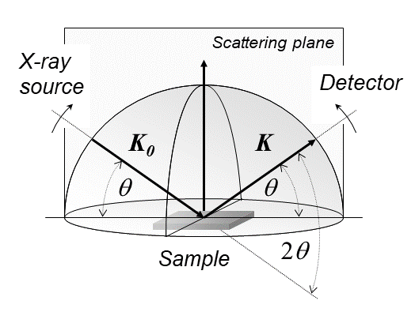

# Introduction

In this tutorial, we will go through the more unique features of the
TurboGAP code that set it apart from other machine-learning interatomic
potential codes/engines: the ability to predict experimental
observables, and infer structures from experimental data via multiple
means.

TurboGAP can give predictions which scale linearly with the number of
atoms for:

1.  X-ray diffraction (XRD)
2.  Neutron diffraction (ND)
3.  Pair Distribution Functions (PDFs) - both standard and corrected by
    atomic form factors/neutron scattering lengths.
4.  X-ray Photoelectron Spectroscopy (XPS)

And we further have aims to extend this to more observables: Raman, IR,
NMR, XAS and TEM just to name a few!

In this tutorial, we will try to be an experimentalist (detective): given some experimental
data, and knowledge of the species proportions, can we find out what structure we have analysed?

First, lets see how we can make an experimental observable prediction.

# Prediction

Much of the relevant keywords for TurboGAP to predict powder diffraction-derived quantities (observables 1-3 above) can be found in `input_files/xrd_options`. 

Before looking at it, let's understand the experimental and computational context. 

A diffraction pattern is a an (averaged) representation of a material's reciprocal space. This is why it is useful to identify crystal structures. For XRD, X-rays undergo diffraction in the material due to the electron density: different atoms have different electronic densities, and result in differing intensities. For neutron scattering, it is due to the atomic nuclei. Bragg's law, $n \lambda = 2 d \sin\theta$ the famous rule for constructive interference, shows that the interplanar spacing (which can be defined by the change in scattering vector $\mathbf{q} = \mathbf{K}-\mathbf{K}_0 ,\,\, q =  4\pi \sin \theta / \lambda, \,\, q = 2 \pi / d_{hkl}$). Hence the proportion of different planes which make up a material (this is the dual of the atomic, real-space representation of a system), can be understood and the crystal structure can be deduced. Crystalline structures exhibit sharp and well-defined peaks, whereas amorphous systems have diffuse peaks. 

The experimental setup is as so:

From the above image, we can see that a powder xrd pattern (so called powder as powders are averaged over all orientations). Averaging the measured intensity over the azimuthal coordinate gives us a 1-d graph of intensity, vs $q =|\mathbf{q}|$. This is what experimentalists generally obtain. 

The Fourier transform of the 1-d XRD/ND powder pattern is the pair distribution function (modified by scattering factors). Hence, for the calculation of XRD, we can go from the _pair distribution function_ to the XRD/ND pattern. $$  g_{ab}(r) =  \frac{n_{ab}(r)}{4\pi r^2\,d r N_a \rho_b } $$

This scales as $\mathcal{O}(N)$ compared to the traditional Debye equation ($\mathcal{O}(N^2)$).
From the above histogram form of the pair distribution function, we cannot
account for thermal/instrumental broadening of the observable. We can rectify
this by doing a kernel density estimate cannot account for thermal/instrumental
broadening of the observable (the $\sigma$ can be directly related to Debye-Waller factors). 

$$\begin{aligned}
    {\hat{g}_{ab}}(r; \{\mathbf{r}\}) = &\frac{1}{ \sqrt{2\pi}} \frac{V}{4\pi r^2 N_a N_b } \nonumber\\ &\sum_i \sum_{j\neq i} \frac{1}{\sigma_{{ij}}}\exp\left( - \frac{ (r - r_{ij})^2}{2\sigma^2_{ij}}  \right) \delta_{s(i),a}\delta_{s(j),b},
  \end{aligned} $$

We can transform this to the XRD pattern through partial structure factors. Here, we use the Ashcroft-Langreth formalism
$$ \begin{aligned}
S_{ab}(Q)  = &\delta_{ab} + 4\pi \rho (c_{a} c_{b})^{1/2} \\
&\int_0^{r_{\rm cut}} \, \text{d}r \, r^2 \frac{\sin( Q \, r )}{Q \, r} \frac{\sin( \pi \, r / r_{\rm cut} )}{\pi \, r / r_{\rm cut}} [ g_{ab}(r) - 1 ],
\end{aligned} $$
where we have introduced a "window" function $w(r) = \sin( \pi r / r_{\rm cut} )/(\pi r / r_{\rm cut})$,
which suppresses oscillations in the partial structure factors arising from the introduction of the cutoff $r_{\rm cut}$.

From the partial structure factors, we can obtain the full \gls{XRD} intensity
by a summation over system species types:
$$ \begin{aligned}
I^{\rm X}(Q) = &\sum_{a,b}^{n_{\rm s}} f_{a}(Q) f_{b}(Q) (c_{a}c_{b})^{1/2}  \left[ S_{a b}(Q) - \delta_{a b}\right] \nonumber\\ &+ \sum_{a}^{n_{\rm s}} c_{a}f_{a}(Q)^2.
\end{aligned} $$

Hence, there are a number of parameters which are needed for the calculation! 

<!-- Partial structure factors are:  -->

<!-- $$  \begin{aligned} -->
<!--     \frac{\partial}{\partial r_{k}^{\alpha}} {\hat{S}_{ab}}(Q; \{\mathbf{r}\}) &=  4\pi \rho (c_{a} c_{b})^{1/2} \nonumber\\ &\int^{r_{\rm cut}}_0 \,d r   \left( r^2\frac{\sin( Q r )}{Qr} \frac{\sin( \pi r / r_{\rm cut} )}{\pi r / r_{\rm cut}}  \frac{\partial {\hat{g}_{ab}}(r; \{\mathbf{r}\})}{\partial r^{\alpha}_k}  \right). -->
<!--   \end{aligned} $$ -->

<!--   Modify these by the scattering factors to get the XRD/ND gradients. -->
<!--   \begin{equation} -->
<!--     \frac{\partial I^{\rm X}(Q; \{\mathbf{r}\})}{\partial r^{\alpha}_k} = \sum_{a b}^{n_{\rm s}} f_{a}(Q) f_{b}(Q) (c_{a}c_{b})^{1/2}  \frac{\partial \textcolor{ForestGreen}{\hat{S}_{a b}}(Q; \{\mathbf{r}\})}{\partial r^{\alpha}_k}, -->
<!--   \end{equation} -->

<!--   Finally obtain the forces to match experiment. -->
<!--   \begin{equation} -->
<!--     \tilde{f}_k^{\alpha} = - \frac{\partial -->
<!--       V^{\rm X}}{\partial r^{\alpha}_k}  =  - \gamma \mathbf{w}\odot\frac{\partial -->
<!--       \mathbf{I}^{\rm X}_{\rm pred}}{\partial r^{\alpha}_k} \cdot \left( \mathbf{w}\odot \left( -->
<!--         \mathbf{I}^{\rm X}_{\rm {pred}} - \mathbf{I}^{\rm X}_{\rm {exp}} \right) \right). -->
<!--   \end{equation} -->


```config
                                         # --- PDF parameters ---
                                         # ----------------------
do_pair_distribution        = .true.     # Calculate the XRD from the pair distribution 
                                         # function, so it scales linearly with the number of atoms
pair_distribution_kde_sigma =   0.1      # -> Use Gaussian Kernel Density Estimate of 
                                         #    width 0.1A to smooth out, accounting for thermal
                                         #    broadening
pair_distribution_partial   = .true.     # -> Calculate partial pair-distribution functions
pair_distribution_rcut      =  10.6      # -> Cutoff partial pair distribution 
r_range_min                 =   0.1      # -> Range for the PDF calculation   
r_range_max                 =  10.0      # -> Range - " - 
write_pair_distribution     = .true.     # -> Write out pair distribution functions 


                                         # --- SF parameters ---
                                         # ---------------------
do_structure_factor         = .true.     # Use (raw, non-scattering factor corrected) 
                                         # (partial) structure factor(s) for calculations 
structure_factor_from_pdf   = .true.     # -> Fourier transform the pair distribution functions 
                                         #    to obtain the uncorrected structure factors, which
                                         #    when corrected give the XRD pattern. 
structure_factor_window     = .true.     # -> Use a multiplicative "windowing" function 
                                         #    (sin(pi r / r_cut)/(pi r / r_cut)) in the fourier transform
                                         #    of pdf to minimize high frequency artifacts resulting
                                         #    from the finite range fourier transform.
write_structure_factor      = .true.     # -> Write out structure factors


                                         # --- X-ray parameters ---
                                         # ------------------------
do_xrd                      = .true.     # Do X-Ray diffraction prediction 
q_range_min                 =   0.1      # -> Range for the XRD/structure factor calculation:
                                         #    q = 4 pi sin( theta ) / lambda, where theta is 
                                         #    the half angle of diffraction
q_range_max                 =  10.0      # -> - " - 
write_xrd                   = .true.     # -> Write out xrd pattern
xrd_output                  = 'q*F(q)'   # -> Output the XRD pattern as the direct Fourier 
                                         #    transform of G(r), the reduced PDF (this can be 
                                         #    'F(q)'/'i(q)' or the full xrd intensity 'xrd')

```


As can be seen in the `input_files/xrd_options`


Similarly, one can do this for XPS, which will be mentioned later.

## Exercise 1. 

Here, we will just get used to using the prediction terms. 

First, lets do a simple simulation where destroy some graphite with oxygen. 

```python
from ase.lattice.hexagonal import *
import ase.io as io
from ase import Atoms, Atom
from ase.neighborlist import NeighborList, natural_cutoffs
import copy

index1 = 4
index2 = 3
mya    = 2.46
myc    = 6.70 

stacks = 2 

gra = Graphite(symbol = 'C',latticeconstant={'a':mya,'c':myc},
               size=(index1,index2,stacks))
io.write('graphite.xyz', gra, format='extxyz')

# Now modify this with some oxygen 

nc = len( gra )
no = ceil( nc / 3 )
n_tot = nc + no 
o_c_ratio = no / nc 

px  = gra.cell[0]
py  = gra.cell[1]
pz  = gra.cell[2]

atoms = copy.deepcopy( gra )

dist_tol = 1.0

for i in range( no ): 
   inserted_O = False 
   tried_O = False 
   while ( not inserted_O ): 
        r3 = np.random.random_sample( (3,) )
        position = px * r3[0] + py * r3[1] + pz * r3[2]
        
        if ( not tried_O ): 
           new_atom = Atom( 'O', position = position  ) 
           trial_atoms = atoms.append( new_atom )
           tried_O = True
        else: 
           trial_atoms.position[-1] = position
        
        distances = atoms.get_distances( len(trial_atoms) - 1, mic=True )
        if ( any( distances < dist_tol ) ): 
           continue 
        else: 
            inserted_O = True
            atoms = copy.deepcopy( trial_atoms )

io.write('atoms.xyz', atoms, format='extxyz')

```


# Structural Inference

## Reverse Monte-Carlo

As seen in our paper *Experiment-Driven Atomistic Materials Modeling: A
Case Study Combining X-Ray Photoelectron Spectroscopy and Machine
Learning Potentials to Infer the Structure of Oxygen-Rich Amorphous
Carbon* <https://pubs.acs.org/doi/full/10.1021/jacs.4c01897>

We can create an XPS-optimized structure by modifying the total energy
of the system $E_{\rm total}$ with a pseudoenergy term $E_{\rm spectra}$
which reflects how well our predicted spectra
$h_{\rm pred}(E, \{\mathbf{r}\})$ agrees with an experimental spectra
$h_{\rm exp}(E)$, where here $E$ corresponds to the core-electron
binding energy scale. $$ \tilde{E} = E_{\rm total} + E_{\rm spectra} $$

We define
$$ E_{\rm spectra} = \frac{1}{2} \gamma \left( \mathbf{h}_{\rm pred} - \mathbf{h}_{\rm pred} \right)^2$$
where the bold font shows that we have represented the spectrum as a
vector, with samples $[\mathbf{h}]_i$ at $[\mathbf{E}]_i$.

We can use this energy Grand-Canonical Monte-Carlo simulations to create
structures which agree with experimental XPS data by design.

### Invoking XPS optimization in Turbogap

We simply add this to the input file

``` config
# Experimental Data Specification
n_exp = 1                                     # Number of experimental observables we wish 
                                              # the structure to replicate
exp_labels = 'xps'                            # Labels of experimental observables 
                                              # (currently limited to xps/xrd/nd/pdf)
exp_data_files = 'xps_spectra_interp.dat'     # Experimental data
exp_n_samples = 501                           # Number of samples for linear interpolation 
                                              # of experimental data (needed if data is not on 
                                              # a uniform grid), this number should be greater 
                                              # than the number of data points in the experimental file.
exp_energy_scales = 10.0                      # The energy scale "gamma" as above
```

If experimental data is added, and it is possible to calculate the
observable, **TurboGAP** by default will calculate the $E_{\rm spectra}$
term and add it to the total energy.

To turn this off, we can set \`exp~energies~ = .false.\`

We can also do reverse monte-carlo using multiple types of experimental
data, such as with this arbitrary example.

``` config
n_exp = 2                                              
exp_labels = 'xps' 'xrd'                               
exp_data_files = 'xps_spectra_interp.dat' 'xrd_CO.dat' 
exp_n_samples = 501 201                                
exp_energy_scales = 10.0 100.0                         
```


## Molecular Augmented Dynamics

Reverse Monte-Carlo is very useful for being able to sample complex observables, where derivatives with respect to the atomic position are lacking, however, it is prone to being stuck in minima. In general the acceptance criterion for a monte-carlo move is $\alpha \propto \exp (-\Delta E)$. Hence, when there are stable motifs found in the structure, it is very hard for the whole system to move out of them, with many trial configurations being rejected, which reduces efficiency. 

Molecular dynamics, on the other hand, is efficient: every evaluation the energy and forces will be put to good use. This does however mean that one must implements gradients of the experimental potential, which is a pain. However, I have gone through that pain for you. 

This means that we can greatly scale our simulations from before. As shown in our preprints (https://arxiv.org/abs/2508.17132, and  https://arxiv.org/abs/2509.22388) we can go up multiple orders of magnitude in terms of system size due to this. 


$$\begin{aligned}
    V_{\rm total}           &= V_{\rm GAP} + \tilde{V}_{\rm exp} \\
    \tilde{V}_{\rm exp}     &=  \frac{1}{2} \gamma \left( \mathbf{w} \odot \left(\mathbf{I}_{\rm {pred}}( \{\mathbf{r}\} ) - \mathbf{I}_{\rm {exp}}\right)\right)^2 \\
    \tilde{f}_{ k}^{\alpha} &= -\frac{\partial \tilde{V}_{{\mathrm{exp}}}}{\partial r^{\alpha}_k} \\
                            &=   - \gamma \mathbf{w} \odot \frac{\partial \mathbf{I}_{\rm pred}(\left\{ \mathbf{r}\right\})}{\partial r^{\alpha}_k} \cdot \mathbf{w} \odot \left(\mathbf{I}_{\rm {pred}}(\left\{ \mathbf{r}\right\}) - \mathbf{I}_{\rm {exp}} \right).
\end{aligned}$$


$$  \begin{aligned}
    \frac{\partial}{\partial r_{k}^{\alpha}} {\hat{S}_{ab}}(Q; \{\mathbf{r}\}) &=  4\pi \rho (c_{a} c_{b})^{1/2} \nonumber\\ &\int^{r_{\rm cut}}_0 \,d r   \left( r^2\frac{\sin( Q r )}{Qr} \frac{\sin( \pi r / r_{\rm cut} )}{\pi r / r_{\rm cut}}  \frac{\partial {\hat{g}_{ab}}(r; \{\mathbf{r}\})}{\partial r^{\alpha}_k}  \right).
  \end{aligned} $$

  Modify these by the scattering factors to get the XRD/ND gradients.
$$    \frac{\partial I^{\rm X}(Q; \{\mathbf{r}\})}{\partial r^{\alpha}_k} = \sum_{a b}^{n_{\rm s}} f_{a}(Q) f_{b}(Q) (c_{a}c_{b})^{1/2}  \frac{\partial {\hat{S}_{a b}}(Q; \{\mathbf{r}\})}{\partial r^{\alpha}_k},
$$

  Finally obtain the forces to match experiment.
  $$
    \tilde{f}_k^{\alpha} = - \frac{\partial
      V^{\rm X}}{\partial r^{\alpha}_k}  =  - \gamma \mathbf{w}\odot\frac{\partial
      \mathbf{I}^{\rm X}_{\rm pred}}{\partial r^{\alpha}_k} \cdot \left( \mathbf{w}\odot \left(
        \mathbf{I}^{\rm X}_{\rm {pred}} - \mathbf{I}^{\rm X}_{\rm {exp}} \right) \right).
$$


## General considerations when using experimental estimations

One must be aware of the possible pitfalls when using what's called a "forward"
model for prediction: _i.e., going from an atomic structure to an observable_.
Observations gathered from an experiment are usually assumed to be at
thermodynamic equilibrium, which means that the typical ensemble statistics
hold: _i.e. using configurations sampled from the thermodynamic partition
function of choice, we can obtain a reasonable estimate of an observable._Much
of the time in our simulations, we wish to assume that our simulation cell is
close enough to the real system, which allows one to forgo the need for multiple
configurations from an ensemble. Care must be taken when considering systems
undergoing transitions as typically the number of configurations needed can
drastically change, especially if the transition is disordered. 

